Model Training Notebook: [Link Here](https://colab.research.google.com/github/jjmoncus/MV_coursework_2/blob/main/Machine_Vision_Final_Lab_Model_Training.ipynb)

Model Inference Notebook: [Link Here](https://colab.research.google.com/github/jjmoncus/MV_coursework_2/blob/main/Machine_Vision_Final_Lab_Model_Inference.ipynb)

Final Model on HuggingFace: [Link Here](https://huggingface.co/jjmoncus1/mv-final-assignment)

# Executive Summary

Here are what I consider to be the most valuable learnings from over the course of this project.

* Trying to learn features from scratch directly on raw videos produced underwhelming results.

  * A two-stage CNN suffered from chronic vanishing gradients and failed to learn.
  * After many small fix attempts, a ResNet eventually fixed the vanishing gradients problem, but trained very slowly, and with underwhelming final accuracy.

* If you can justifiably change your regression problem into a classification problem, then the learning task likely becomes easier.

* Preprocessing videos using pose estimation immediately gave us information-rich representations that quickly acheived better results, compared to learning features from scratch.

* Augmentating the data helped acheive a sufficiently large, class-balanced training set, and subtle smoothing helped avoid confusing the model with sharp movements.

* There is an art to balancing model size/complexity, weight decay, and learning rate scheduling to learn suffiiently complex relationships, avoid overfitting, and not waste training time.

*Note*: All published numbers refer to training/inference runs on my local machine. See final section for comments when trying to run in Colab.


# Learning About the Data

Some observations about the training videos:

  - All 24 FPS, total length roughly 90-360 frames (i.e. $\approx$ 3.5 - 10 seconds).

  - Most are in wide-screen. If we squish to 224x224 for training, the subject might will unnatural, but the push-up movement might be preserved.

  - Videos are shot from all angles (side, front, above), and sometimes with camera movement, i.e. we have to take into account camera effects.

  - Since pushups are mostly smooth movements, we may be able to stride over frames (i.e. only look at every 5th or 10th frame of a video) and still see the subject's movement, thus saving memory.


# 1) Learn the Features from Scratch (With Underwhelming Results)

I was inspired to see whether the task was possible without worrying too much about feature engineering. The promise of a deep learning approach is that the model may be able to learn useful data representations on its own, and I was excited to see what could be done by using raw videos.

In hindsight: all of these approaches suffered from severe problems:

* Underwhelming final training accuracy
* very long training time (30 epochs could easily take ~3 hours).
* memory overload: training would consistently take up anywhere from 10GB to 14GB of unified MPS memory (on Mac)

In the end, I defaulted to pose estimation to work with smaller data that was still informative to our task. 

Below is a record of what I tried first:


## 1.1): A Basic CNN for both space and time

To track the subject's pushup movement over space and time, I proposed a two-part architecture:

  - A series of 2D-convolutions on each frame, to extract spatial features about the subject and its surroundings.
  - A series of 1D-convolutions across frames, to see how those spatial features changed over time.
  - A linear head.

I trained with the following fixed parameters:

* 10 epochs
* mean squared error loss (i.e. regression)
* a stride of every 10th frame when loading training data, with max frames set to 100.
* learning rate = $1e-3$

Below is the summary of the first model:


\begin{table}[h]
    \centering
    \begin{tabular}{llll}
        \toprule
        \textbf{Stage} & \textbf{Input Shape} & \textbf{Operations} & \textbf{Output Shape} \\
        \midrule
        Spatial Encoder & $(B \times T, 3, 224, 224)$ & 6x "Conv2d (Stride 2) + ReLU" + Linear(640, 2)& $(B \times T, 2)$ \\
        ...             & $(B \times T, 2)$           & expand and transpose        & $(B, 2, T)$ \\
        Temporal Conv   & $(B, 2, T)$                 & 3x Conv1d (Stride 2) + ReLU & $(B, 18, 13)$ \\
        ...             & $(B, 18, 13)$               & Flatten                     & $(B, 234)$ \\
        Classifier      & $(B, 234)$                  & Linear                      & $(B, 1)$ \\
        \bottomrule
    \end{tabular}
    \caption{VideoConvModel: 27,659 parameters}
\end{table}


::: {.callout-note}

## Disclaimer

I reached for a CNN before even trying a fully-connected MLP.

An MLP has much weaker inductive bias than a CNN, since the MLP does not presume translational equivaraince over the input data. This is helpful for learning more complicated relationships, but at the cost of more weights to learn. The CNN  has the advantage of learning to understand pushups regardless of where the subject lives in the frame, whereas an MLP would have to relearn this whenever the subject appears in a new location. The weak inductive bias also makes the MLP more likely to overfit. For this reason, along with our memory footprint limits, a CNN seemed preferable.

In hindsight, starting with an MLP would have been helpful to get a baseline understanding for how difficult our learning problem is. If even a relatively-deep MLP struggles to acheive high training accuracy, then our CNN would likely be insufficient. Luckily, this turned out to not be necessary.

:::

**The Result: Vanishing Gradients**

Every attempt to use a CNN for building spatial features resulted in the model only predicting the mean label for each batch.

Here are the results over 10 epochs of training for a sample run:


\begin{table}[h]
    \centering
    \begin{tabular}{lllll}
        \toprule
        \textbf{Epoch} & \textbf{Validation Loss} & \textbf{Validation Accuracy} & \textbf{St.Dev. of Predictions} & \textbf{Norm of Weights} \\
        \midrule
        1  & 11.6948 & 0.00 & 0.00 & 7.687 \\
        2  & 1.8193  & 0.60 & 0.00 & 7.785 \\
        3  & 1.4695  & 0.13 & 0.00 & 7.804 \\
        4  & 1.7752  & 0.60 & 0.00 & 7.792 \\
        5  & 1.4428  & 0.60 & 0.00 & 7.806 \\
        6  & 1.6283  & 0.60 & 0.00 & 7.801 \\
        7  & 2.1680  & 0.60 & 0.00 & 7.798 \\
        8  & 1.7379  & 0.60 & 0.00 & 7.811 \\
        9  & 1.4397  & 0.60 & 0.00 & 7.830 \\
        10 & 1.4846  & 0.60 & 0.00 & 7.837 \\
        \bottomrule
    \end{tabular}
    \caption{Training Results}
\end{table}

Some observations:

* A prediction standard deviation of 0.00 for every validation pass is a sign that the model has learned to simply predict the mean of the validation set. 
* Validation loss and the total euclidean norm of the model weights are changing (minimally) per pass. So, the model is technically "learning" something, but not nearly enough to affect predictions (as shown by the st.dev.s)
* Validation accuracy is reaches 60% because the mean is well represented in the data, so it gets a fair few videos correct by accident.
* 10 epochs took 10 minutes to run, consuming ~6.54GB VRAM on my Macbook's MPS the whole time.


I tried modifying the CNN a number of ways:

   - added Batch Normalization to each convolutional block in both spatial and temporal stages.
   - less aggressive compression in Linear bottlenecks (adjusting the convolutions' input/output shape accordingly).
   - Increased temporal convolutions kernel size from the default 3 to 5, to try to capture more push-up movement in each step.

Each tweaked model varied significantly in size, up to 669,569 parameters total.

Across 5 attempts with different adjustments, results were similar. The model did not effectively train and only ever predicted the mean of the validation set.


## 1.2): ResNet for Spatial Features

I thought a small ResNet with skip connections might solve the vanishing gradients problem. The skip connections make the loss landscape smoother, which makes calculating gradients easier.

I replaced the spatial feature stage with a pre-built ResNet18, with all weights frozen (to avoid computational overhead).

\begin{table}[h]
    \centering
    \begin{tabular}{llll}
        \toprule
        \textbf{Stage}     & \textbf{Input Shape} & \textbf{Operations} & \textbf{Output Shape} \\
        \midrule
        Spatial Features   & $(B \times T, 3, 224, 224)$ & Pre-trained ResNet18 (Frozen)       & $(B \times T, 512, 1, 1)$ \\
        ...                & $(B \times T, 512, 1, 1)$   & Tranpose                            & $(B, 512, T)$ \\
        Temporal Processor & $(B, 512, T)$               & 3x [Conv1d + BatchNorm + LeakyReLU] & $(B, 32, 13)$ \\
        ...                & $(B, 32, 13)$               & Flatten                             & $(B, 416)$ \\
        Classifier         & $(B, 416)$                  & Linear                              & $(B, 1)$ \\
        \bottomrule
    \end{tabular}
    \caption{VideoResNetModel: 11,408,682 parameters}
\end{table}


Training parameters were the same as before:
* 10 epochs
* mean squared error loss (i.e. regression)
* a stride of every 10th frame when loading training data, with max frames set to 100.
* learning rate = $1e-3$

This architecture successfully trained:

* **St.Dev.s of Predictions:** $\{.63, .94, .62, .94, .91, .90, 1.28, .86, .80, .88, .90\}$
* **Final epoch validation loss:** $1.015$
* **Final euclidean norm of weights:** $17.615$

**Training Load:** 20 minutes (on macbook MPS), , 12.GB VRAM consumed

**Full training set evaluation**: 63% accuracy.

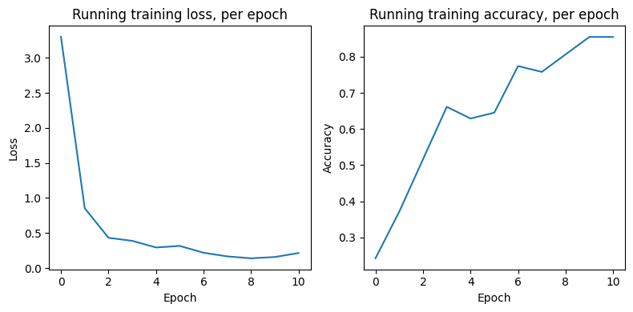{fig-align="center" width=60%}

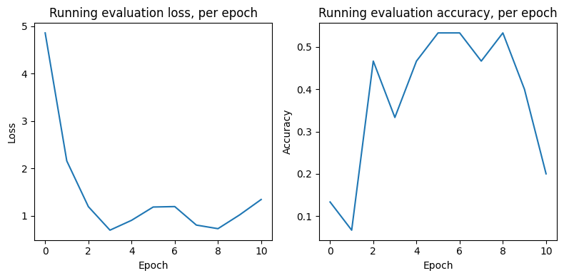{fig-align="center" width=60%}


# 1.2) Building upon ResNet

I tried a series of modifications to see if this ResNet backbone could successfully tackle the problem:

### 1.2.0) Unfreeze some ResNet weight 

ResNet18 is pre-trained on ImageNet, and thus understands a lot about various objects, including people and landscapes. However, it may not understand anything specific about pushups. I unfroze the final layer of the resnet backbone to see if weight-updates would help it recognize spatial features important for counting pushups. 

**Result**: 
 - **Full training set evaluation**: 43% accuracy
 
 This dataset is likely not large enough to make a meaningful dent in ResNet18's weights for this task. I refroze all ResNet-backbone weights going forward.


### 1.2.1) Switching to Classification

In previous attempts, the model would be penalized for small deviations from integer predictions, and the rounded, predicted number of pushups was often one off from the actual value, suggesting the model was getting close but not within rounding distance.

I tried switching to ten-class classification to force integer predictions, using cross-entropy-loss. I amended the output layer of the Resnet Hybrid architecture above to output with shape $[\text{Batch}, 10]$, and predicted with the max of these raw scores.

**Result**: 
 - **Full training set evaluation**: 65% accuracy after ~20 epochs (1.5 hours)


Intuitively, classification should be slightly easier - it's like asking the model to pick amongst 10 buckets, instead of asking it to hit an exact spot on a continuous line.

All model attempts going forward used cross-entropy loss, instead.


### 1.2.2) Trying Data Transformations

I was concerned about how small our dataset is. Data transformations on load could allow our modelto see slightly different versions of training points during each epoch, thus artificially "expanding" the size of our dataset and hopefully nudging the model to not overfit.

Online research suggested it was important that transformations needed to be applied the same way to all frames within a given video. Random cropping or color jitter applied non-uniformly would make the video look chaotic and warbly, making the learning problem more difficult. I built wrapper functions which generated a random seed per video and guaranteed the same random operations were copied across all frames in the same video.

I tried two different sets of training and validation transformations: one "difficult" and one "easier": 

**Difficult**

```{python}
#| eval: false

## Directly copied from Practical 9
train_transform = T.Compose([
    
    T.Resize( (224, 224) ),
    T.RandomCrop(150), 
    
    T.RandomHorizontalFlip(p = .1),
    T.RandomVerticalFlip(p = .1),
    T.RandomRotation(degrees = 10), 
    
    T.ColorJitter(brightness=0.1, contrast=0.1, saturation=0.1),

    T.Normalize(mean = [ 0.485, 0.456, 0.406 ],std = [ 0.229, 0.224, 0.225 ])
])

val_transform = T.Compose([
    
    T.Resize( (224, 224) ),
    T.CenterCrop(150), 
    T.Normalize(mean = [ 0.485, 0.456, 0.406 ],std = [ 0.229, 0.224, 0.225 ]) 
])
```


**Easier**

```{python}
#| eval: false
train_transform = T.Compose([
    
    # --- random crop is confined to the edges
    T.Resize((240, 240)), 
    T.RandomCrop(224), 
    
    # --- Removed vertical fip, so all pushups are still going downwards
    T.RandomHorizontalFlip(p=0.5), 

    # --- Reduced from 10 to 5 degrees
    T.RandomRotation(degrees=5),
    
    # --- smaller brightness and contrast jitter, no saturation change
    T.ColorJitter(brightness=0.05, contrast=0.05),
    
    T.Normalize(mean=[0.485, 0.456, 0.406], std=[0.229, 0.224, 0.225])
])

val_transform = T.Compose([
    
    # removed random crop
    T.Resize((224, 224)), 

    T.Normalize(mean=[0.485, 0.456, 0.406], std=[0.229, 0.224, 0.225]) 
])
```


In the end, both implementations made the model significantly worse:

**Results**:

* **Difficult**: 36% final training accuracy
* **Easier**: 55% final training accuracy

The RandomCrop(150) and VerticalFlip were the likely killers in the diffficult transformations. 

* Given we're already resizing to (224, 224), the subject is already scrunched, as is. A random resize to (150, 150) might cut out entire sections of the subject's body.
* Pushups always happen downward. Asking the model to learn to recognize pushups "upward" was, in hindsight, unfair.

I scrapped both transformation sets going forward.

*(Later, different transformations became very useful - more on that in section 2.0.1 below).*


### 1.2.4) The same temporal convolutions, but deeper.

The next unlock came from simply adding another layer each to the temporal and classification stages of the original resnet architecture:

\begin{table}[h]
    \centering
    \begin{tabular}{llll}
        \toprule
        \textbf{Stage}     & \textbf{Input Shape}        & \textbf{Operations}                 & \textbf{Output Shape} \\
        \midrule
        Spatial Features   & $(B \times T, 3, H, W)$     & Pre-trained ResNet18 (Frozen)       & $(B \times T, 512, 1, 1)$ \\
        ...                & $(B \times T, 512, 1, 1)$   & Unpack dimensions                   & $(B, T, 512)$ \\
        Temporal Processor & $(B, 512, T)$               & 4x [Conv1d + BatchNorm + LeakyReLU] & $(B, 32, 7)$ \\
        ...                & $(B, 32, 7)$                & Flatten                             & $(B, 32 \times 7)$ \\
        Classifier         & $(B, 32 \times 7)$          & 2x [Linear + LeakyReLU]             & $(B, 10)$ \\
        \bottomrule
    \end{tabular}
    \caption{VideoResNetModel: 11,726,522 parameters}
    \label{tab:video_resnet_conv1d}
\end{table}


**Result**: 
* **Final evaluation accuracy**: 75% (~25 epochs, 2 hours)


### 1.2.5) Data Augmentation for Class Balance

It had not dawned on me until now that most training videos contained 2, 3, and 4 pushups. Given we don't know the class balance of our test set, I needed to expand the training set reliably predict anywhere from 1 to 10.

After some online research, I landed on the following augmentations of the given training data:

\begin{table}[h]
    \centering
    \begin{tabular}{ll}
        \toprule
        \textbf{Operation} & \textbf{Labels Gained} \\
        \midrule
        Cut all 2's in half & 1's \\
        Cut all 4's in half & 2's \\
        Extend 3's by about $2/3$ & 5's \\
        Double 3's & 6's \\
        Extend 4's by about $3/4$ & 7's \\
        Double 4's & 8's \\
        Triple 3's & 9's \\
        Double 5's (including previously-generated) & 10's \\
        \bottomrule
    \end{tabular}
    \caption{Video Stretching and Slicing Operations}
\end{table}


We acheive a more balanced dataset, with the following label counts:

 
\begin{table}[h]
    \centering
    \begin{tabular}{l|llllllllll}
        \toprule
        \textbf{Label} & 1 & 2 & 3 & 4 & 5 & 6 & 7 & 8 & 9 & 10 \\
        \midrule
        \textbf{Count} & 33 & 58 & 34 & 21 & 36 & 36 & 22 & 21 & 34 & 34 \\
        \bottomrule
    \end{tabular}
    \caption{(1.2.5) training set labels and counts (329 total)}
\end{table}

Slicing needed to be done with care to avoid jump cuts, which could be misinterpreted by the model as pushups. I thus concatenated "palindrome stitches", i.e. the *reverse* list of frames with the original, like so:

* Doubles = Original + Palindrome
* Triples = Original + Palindrome + Original
* 3 to 5 = Original + (Palindrome * 66%)
* 4 to 7 = Original + (Palindrome * 80%)

I used 66% and 80% instead of 60% and 75% stitches for the 5's and 7's to account for many videos containing a little bit of "dead space" at the beginning before the subject first moved, which would downstream cut the 5th and 7th push-ups too early.

All cut-in-half videos were cut at the nearest integer to the midpoint frame.

Training was done using the deeper ResNet Hybrid (1.2.4) (~29 epochs, 2.5 hours)

**Results:**
* **Final evaluation accuracy**: 19%.

The model had a strong tendency to overcount push-ups, suggesting the stiching was introducing noisy movements that were being misinterpreted as push-ups.


### 1.2.6) Simpler Augmentation

At this point, I was frustrated that no data augmentation seemed to help. I naively decided to make a copy of every video by first flipping it horizontally and reversing the order of frames. This doubled the size of the training set, but retained the harsh class imbalance.

Training was again done with the (1.2.4) ResNet Hybrid.

**Result:**
* **Final evaluation accuracy**: 75%

Unsurprisingly, ResNet Hybrid (1.2.4) acheived this result with just 9 epochs of training. This mirrors the result from (1.2.4), and we can chalk up the faster convergence to the dataset being larger.


::: {.callout-note}

## Training Hygiene

Over the course of the failures throughout (1), I stumbled upon a number of helpful training tips to make life easier:

  - **weight decay**: After each batch, the typical weight update is dictated by the learning rate. But to keep the model from overfitting, we can multiplicatively pull the model towards smaller updates using a small weight decay parameter. I tinkered with values of 1e-4 to 9e-4, with varying degrees of success.

  - **A learning rate scheduler**: If the learning rate is too high, the weight updates may be too large, which can keep us from descending towards a minimum in the loss landscape. After a few epochs of no improvements, you can "schedule" your learning rate to drop by some percentage, making it more likely that an update will lead you downhill. I tinkered with schedule dops of 1/2 to 1/10th the previous learning rate after 2 or 3 epochs of no improvement in validation loss.
  - **AdamW**: The AdamW optimizer is specifically designed to decouple weight decay from its adaptive learning rates, as compared to Adam, which scales the weight decay by the learning rate. I switched to AdamW avoid misinterpeting how I was regularizing during training.
  - **Early stopping**: I eventually implemented a rule where the training loop would end early if the learning rate ever fell below $1e-8$. At that rate, weight updates are unlikely to be meaningful.
  - **Saving your Best**: You don't necessarily have to keep the model returned after the final epoch. Sometimes, the weights associated with lowest validation loss (and thus the one which in theory will generalize best) will happen sometime in the middle of training. I eventually implemented a section of my training protocol which, anytime a new "best validation loss" was acheived would save a "checkpoint" of the model, optimizer, and scheduler states. That way, I always had access to the best model "so far."

I implemented each of these in my final, successful attempts (2).

:::

# Summary of 1)

**Good news**

* Our best attempt at learning features from scratch acheived 75% evaluation accuracy on our training data. 

**Bad News**

* Training suffered from severe class imbalance.
* Training takes so long that it's difficult to experiment with different training parameters and small architecture tweaks.
* All attempts at data augmentation (which is in theory supposed to help) made the model significantly worse.

\pagebreak


# 2) A Better Way: Pose Estimation


While it is true that the subject's relationship with its surroundings (like the ground) changes over the course of a push-up, the essence of a push-up is mostly about the body's joints' orientation to each other: 

  - the shoulders and wrists coming together as the elbow moves backwards,
  - the torso and back lowering and raising
  - the feet staying fixed

Tracking these movements alone may be enough for our task. This approach would allow us to use significantly lower-dimensional data for every frame, which speeds up training.

**Choosing a model**

After some online research, I debated choosing between MediaPipe (by Google) and YOLO (by Ultralytics). Various MediaPipe versions run pose estimation on frames $(128 x 128)$ or $(256 x 256)$. Recent version of YOLO were trained on $(640 \times 640)$ frames.

\begin{table}[h]
    \centering
    \begin{tabular}{llll}
        \toprule
        .. & \textbf{MediaPipe}    & \textbf{YOLO (later versions)} \\
        
        \textbf{Trained Frame Size} & $(224 \times 224)$ or $(256 \times 256)$, depending on the model & $(640 \times 640)$ \\
        \textbf{How many people?} & Single-person tracking & Multi-person tracking \\
        \textbf{Dimensions} & 2D and 3d & 2D \\
        \bottomrule
    \end{tabular}
    \caption{Pose Estimation Model Comparison}
\end{table}

Both models resize input frames before processing, so both might introduce issues working with our widescreen videos.

Given we know there will only be one person in all of our videos, I chose MediaPipe, hoping its outputs would be simpler to index. Experimenting with pasting MediaPipe's pose estimates onto video frames were promising:

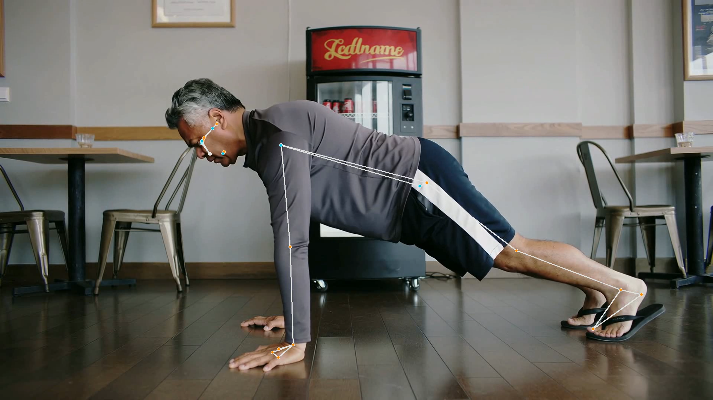{fig-align="center" width=50%}

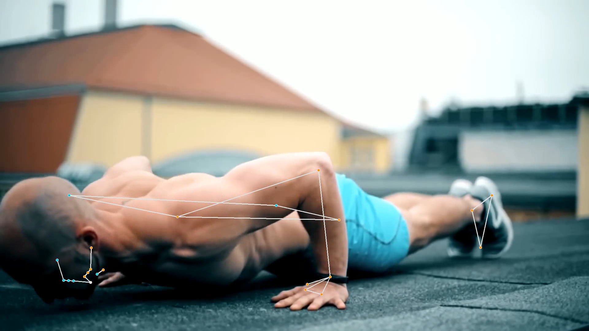{fig-align="center" width=50%}

Preprocessing all videos through MediaPipe yields tensors with shape $[Time, 33, 4]$, given 33 joints with 4 features each (x_location, y_location, z_location, and visibility).

After this preprocessing, we no longer work with any raw videos going forward.


## 2.0.1) The Same Data Augmentation from (1.2.5)

Our efforts with the ResNet were not all a waste! We can acheive a class-balanced training set by applying the same transformations as in (1.2.5), this time on pose estimations. 

As before, we end up with 329 total training "videos" (pose tensors) distributed roughly evenly over labels 1 through 10.

## 2.1) First Attempt

I tried returning to our roots: a CNN + Linear Classifer, this time after pre-processing videos trough MediaPipe. This model could quickly train 100 epochs on our 329 preprocessed pose files in about a minute.

\begin{table}[h]
    \centering
    \begin{tabular}{llll}
        \toprule
        \textbf{Stage}            & \textbf{Input Shape}    & \textbf{Operations}                     & \textbf{Output Shape} \\
        \midrule
        Preprocess Videos         & $(B, C, T, H, W)$       & Mediapipe Joint Coordinate Esimation    & $(B, T, 33, 4)$ \\
        ...                       & $(B, T, 33, 4)$         & Flatten and transpose                   & $(B, 132, T)$ \\
        Temporal Processor        & $(B, 132, T)$           & 2x [Conv1d + BatchNorm + LeakyReLU] + Global Average Pool    & $(B, 256, 1)$ \\
        Classifier                & $(B, 256, 1)$           & Flatten + Linear + LeakyReLU + Linear   & $(B, 10)$ \\
        \bottomrule
    \end{tabular}
    \caption{PoseModel: 179,482 parameters}
    \label{tab:pose_model_architecture}
\end{table}

**Results**

* **Final evaluation accuracy:** 72% (expanded class-balanced training set), 61% (original training set)

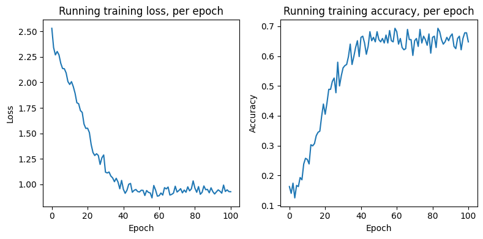{fig-align="center" width=60%}

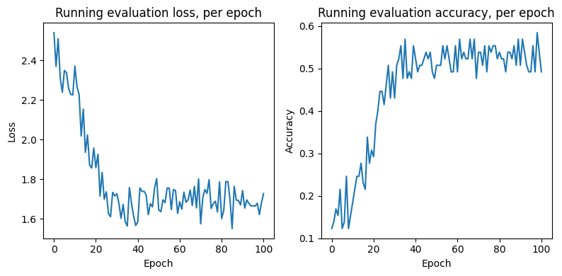{fig-align="center" width=60%}

\pagebreak

The confusion matrix for the results hows some peculiar behavior:

  - Most mistakes are at the margin, predicting one up or down of the actual value (which is a good sign).

  - The model has a tendency to predict 6 on high-count videos. 6 is not super-overly-represented in our training set, suggesting this preference has something to do with push-up signal getting lost somewhere.

  - There are few instances of gross misses (e.g. confusing 8 for 2, or 2 for 7, etc.) These don't seem to be comprehensively explained by our data augmentation (if it were, we would expect more confusions between 3 and 5, or 4 and 7).

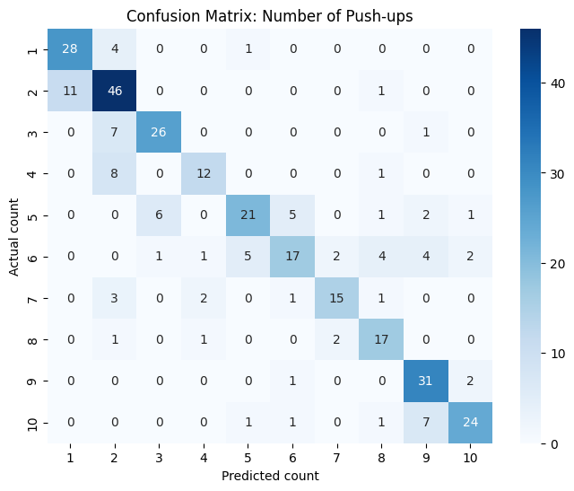{fig-align="center" width=80%}


## 2.1.1) Small Modifications

Now that the time cost of training was so low, I could play with several tweaks:

  - **A small fully-connected layer before temporal stage**

    - the model can learn a more compressed representation of the joint coordinates before passing this representation to the temporal convolutions.

    - Expansions representations (i.e.  132 joint*features -->  256 features) also helped, though less so than compression. 

    - An FC layer with the same in and out channels made the model worse, suggesting the model was liable to learning non-useful representations at this layer, like rotation, translation, or simply noise.

  - **augmenting frame stride and max frame length (holding architecture constant)**

    - stride 10, max frame length 100: 93.5% final accuracy

    - stride 5, max frame length 200: 89% final accuracy

    - stride 3, max frame length 300: 72% final accuracy

    - stride 10, max frame length 200: 7% final accuracy

    - **Takeaway:** Since all videos are going to be under 1000 frames, ensuring $\text{stride} \times \text{max length} = 1000$ guarantees we don't cut off videos too early. A stride of 10 seems to capture enough of the push-up movement to be meaningful. Lower strides run the risk of capturing glitchy movement, which might inflate the pushup count prediction. And if $\text{stride} \times \text{max length} << 1000$, then we end up padding the video with too much "stand-still" frames, which wash out the signal once our temporal layer hits the Global Average Pool at the end.

  - weight decay

    - choosing the right weight decay called for balancing with the model architecture. A slightly larger model would sometimes overfit quickly, and the learning rate scheduler would sometimes exit the training loop after far fewer than 100 epochs. With these models, increasing weight decay had the dual advantage of tempering overfitting while allowing the model to train for longer before hitting the learning rate limit.


## 2.2) Second Attempt

Incorporating the above edits, we get an architecture that looks like this:

\begin{table}[h]
    \centering
    \begin{tabular}{llll}
        \toprule
        \textbf{Stage}            & \textbf{Input Shape}    & \textbf{Operations}                     & \textbf{Output Shape} \\
        \midrule
        Preprocess Videos         & $(B, C, T, H, W)$       & Mediapipe Joint Coordinate Esimation    & $(B, T, 33, 4)$ \\
        ...                       & $(B, T, 33, 4)$         & Flatten                                 & $(B, T, 33 \times 4)$ \\
        Spatial Embedding (FC)    & $(B, T, 33 \times 4)$   & Linear + LeakyReLU                      & $(B, T, 32)$ \\
        ...                       & $(B, T, 32)$            & transpose                               & $(B, 32, T)$ \\
        Temporal Processor        & $(B, 32, T)$            & 3x [Conv1d + BatchNorm + LeakyReLU]     & $(B, 256, 1)$ \\
        Classifier                & $(B, 256, 1)$           & Flatten + Linear + LeakyReLU + Linear   & $(B, 10)$ \\
        \bottomrule
    \end{tabular}
    \caption{PoseModel: 164,538 parameters}
    \label{tab:pose_model_architecture}
\end{table}


**Results**

* **Final Eval Accuracy**: 85% (class-balanced training set) 93.5% (original training set)

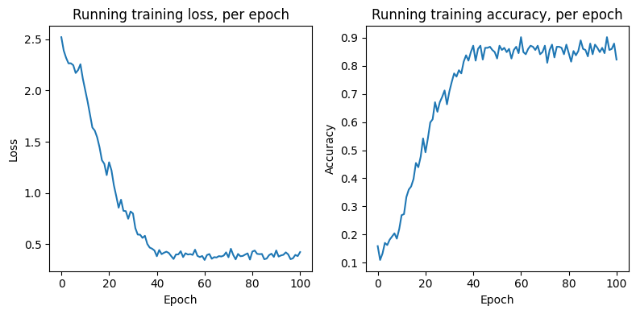{fig-align="center" width=60%}

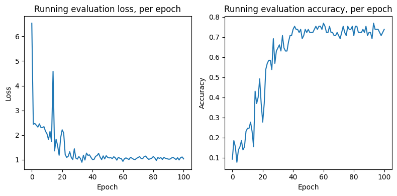{fig-align="center" width=60%}

Our confusion matrix shows nearly all mistakes are on the margin, with the model predicting one up or down of the actual value.

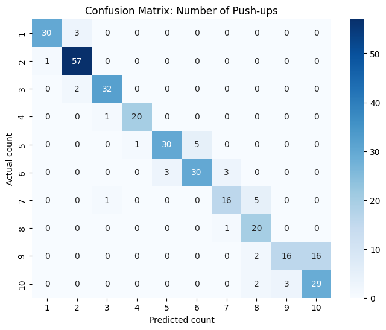{fig-align="center" width=80%}

## 2.2.1) Small Modifications:

- **3D**: I had inadvertently been loading 2-D pose estimates up to this point, so I switched to 3-D (still provided by mediapipe). The 3-D locations are in theory more robust to different camera angles.
- **Smoothing** Up to this point, the majority of mistakes tended to be overcounts, i.e the model seeing push-ups where there are none. This is likely due to the model getting confused by small movements. We can smooth the joint coordinates using the Savitzky-Golay (SavGol) filter with a moderate window size (I chose 7) and moderate polynomial degree (I chose 2) to even out small, unhelpful movements. However, too large a smoothing window, and you risk washing out movements you actually want, whereas too large a polynomial degree, and you risk retaining jitters that aren't meaningful.

- **BatchNorm before first Linear**: just to make sure that data is centered
- **Opened spatial embedding bottleneck:** Changed Linear(132, 32) to Linear(132, 64), allowing more room for complex spatial representations.
- **Both Average and Max Pooling**. Across several experimental runs, it seems Global Average Pooling the temporal layers improved the model's accuracy on high-count videos, but made it worse on low-count ones. Low-count videos are usually shorter and have fewer frames, and the excess padding seems to wash out the real pushup signal from earlier in the video. Switching to Max Pooling helped the model focus on the push-up signal in low count videos, while sacrificing accuracy on the high count ones. The solution seems to be to use both: pool once with the average, once with the max, and then pass both values to the temporal stage. That way, the model has capacity to learn that different combinations of {low/high} {average/max} values tend to yield different counts.
- **Larger classifier input size**: To deal with feeding two pooled inputs instead of one.
- **Remove striding on load**. Previously, we were dealing with motion noise by only loading every 10th frame of each video into each training batch. After frame-poses were smoothed, the model tended to perform worse with any amount of striding, especially on longer videos, where crucial push-up turning points might get lost. For this reason, we load all frames into memory and pad them to 1000 frames as before.
- **Horizontal flipping**: I had forgotten that after transforming videos by duplicating/halving, I could also simply horizontally flip them all, like in (1.2.6). The goal here is to avoid the model overfitting for a certain "handedness" (i.e. the subject slightly leaning to the right or left as they descend).
- **Larger weight decay**: $9e-4$.

The final training dataset consisted of 658 videos, with the following class balance:

\begin{table}[h]
    \centering
    \begin{tabular}{l|llllllllll}
        \toprule
        \textbf{Label} & 1 & 2 & 3 & 4 & 5 & 6 & 7 & 8 & 9 & 10 \\
        \midrule
        \textbf{Count} & 66 & 116 & 68 & 42 & 72 & 72 & 44 & 42 & 68 & 68 \\
        \bottomrule
    \end{tabular}
    \caption{(1.2.5) training set labels and counts (329 total)}
\end{table}


## 2.3) Final Model

After applying the above updates, the final model looks like so:


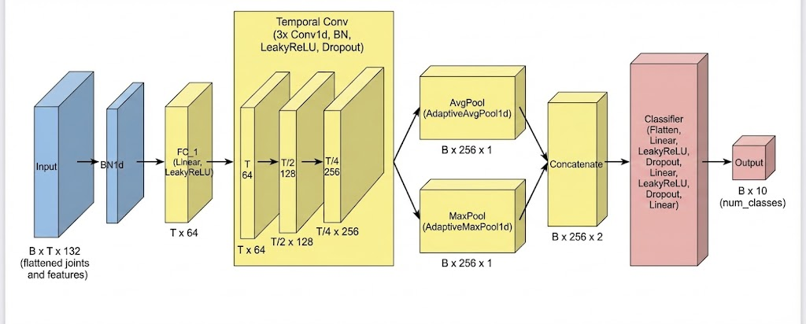{fig-align="center" width=90%}

\begin{table}[h]
    \centering
    \begin{tabular}{llll}
        \toprule
        \textbf{Stage}            & \textbf{Input Shape}    & \textbf{Operations}                     & \textbf{Output Shape} \\
        \midrule
        Preprocessing             & $(B, C, T, H, W)$       & MediaPipe World Landmark Extraction       & $(B, T, 33, 4)$ \\
        Data Prep                 & $(B, T, 33, 4)$         & Flatten Joints/Features            & $(B, T, 132)$ \\
        Spatial Embedding         & $(B, T, 132)$           & BatchNorm + Linear + LeakyReLU            & $(B, T, 64)$ \\
        Temporal Processor        & $(B, 64, T)$            & 3x [Conv1d + BatchNorm + LeakyReLU]       & $(B, 256, 13)$ \\
        Global Pooling            & $(B, 256, 13)$          & AvgPool + MaxPool (Concatenated)          & $(B, 256, 2)$ \\
        Classifier                & $(B, 256, 2)$           & Flatten + 2x (Linear + LeakyReLU) + Linear           & $(B, 10)$ \\
        \bottomrule
    \end{tabular}
    \caption{Final PoseModel: 305,530 parameters}
\end{table}

This model is publically available at **HUGGING FACE URL HERE**

This architecture achieves 93.5% accuracy on the original training videos, as well as 92% accuracy on our class-balanced set.

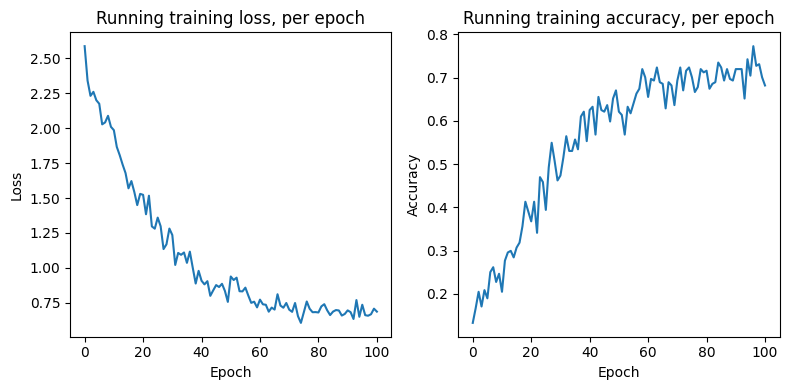{fig-align="center" width=60%}

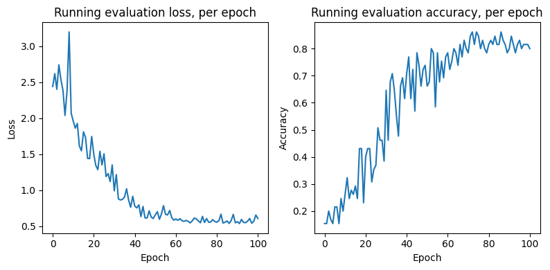{fig-align="center" width=60%}

The confusion matrix (on the class-balanced training set) shows this model still struggles to distinguish between 9 and 10 pushups, but is very good at most other counts.

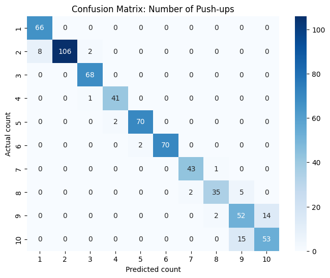{fig-align="center" width=80%}


Here's the screenshot of my final Summary section, when validating on the original set:

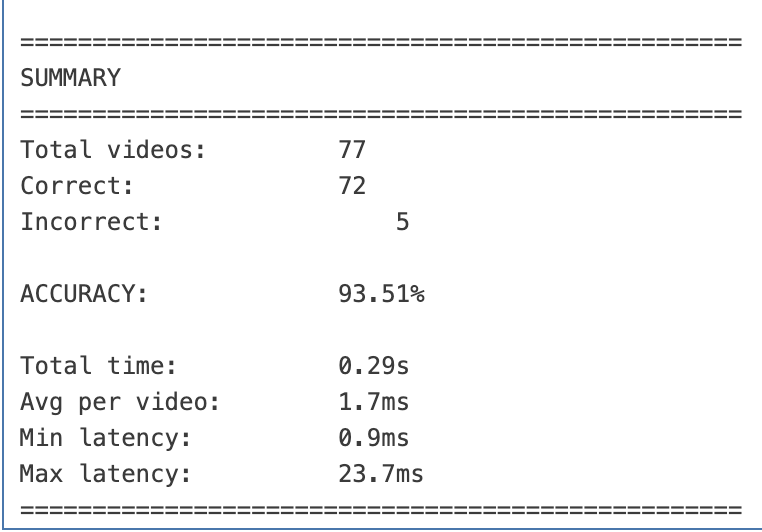{fig-align="center" width=60%}


# Final Update: Discrepancy Between Colab T4 and Local MPS

Upon trying to run my notebooks to Colab, I am getting inexplicably terrible errors. The model would seemingly only predict values of 1, 2, and 3, resulting in 3-5% final accuracy, for reasons I do not at all understand.

I confirmed that both my local environment and the Colab environment were operating in normal float32 precision, so the discrepancy doesn't seem to be a precision error. None of the code is changed. 

Colab also seems to be sometimes load old versions of my code, without warning. I experimented by commenting out chunks, commiting and pushing to Github, and then trying to open in Colab and those chunk won't be commented out. It seems like there's a very long lag between the two.

I have included screenshots of my local machine's console to confirm that this final model did in fact evaluate 93.5% accuracy on the 77 provided videos.

You can see the same messages present in the Colab versions, where I download test videos and then estimate poses on them (You can ignore the "estimate poses in training videos" message ... they are indeed the training/test videos provided to us).

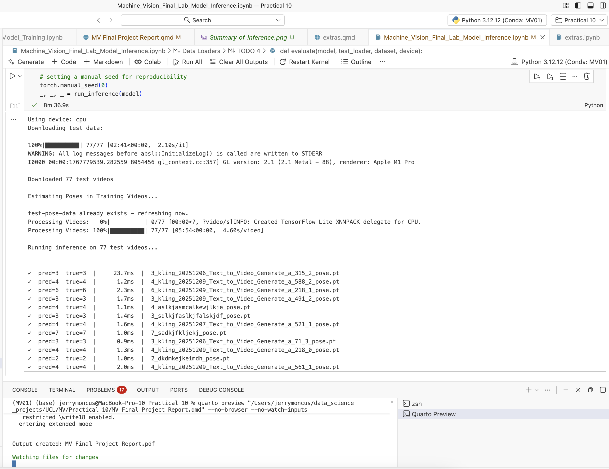{fig-align="center" width=100%}

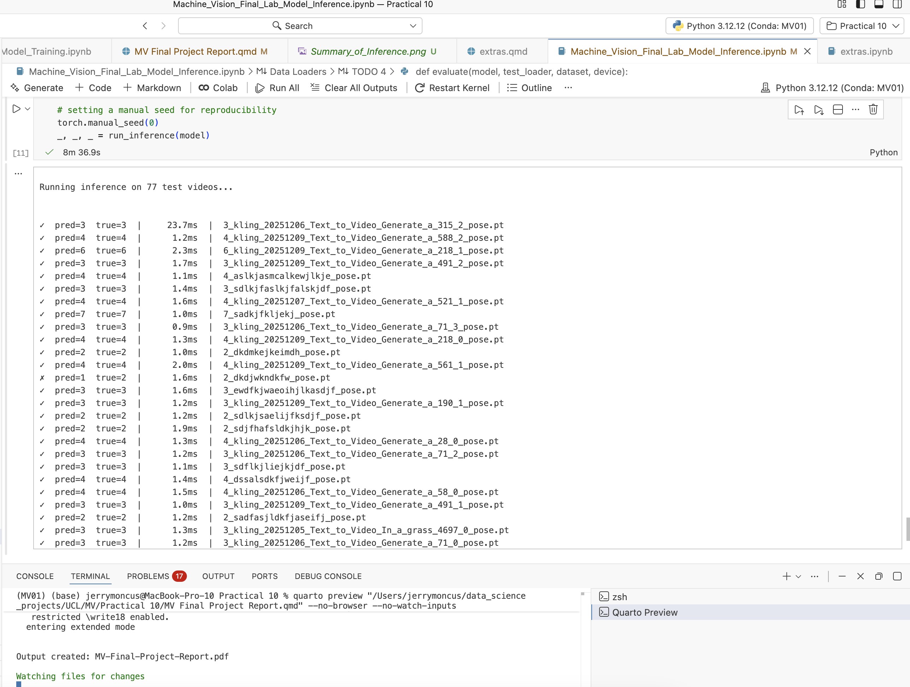{fig-align="center" width=100%}

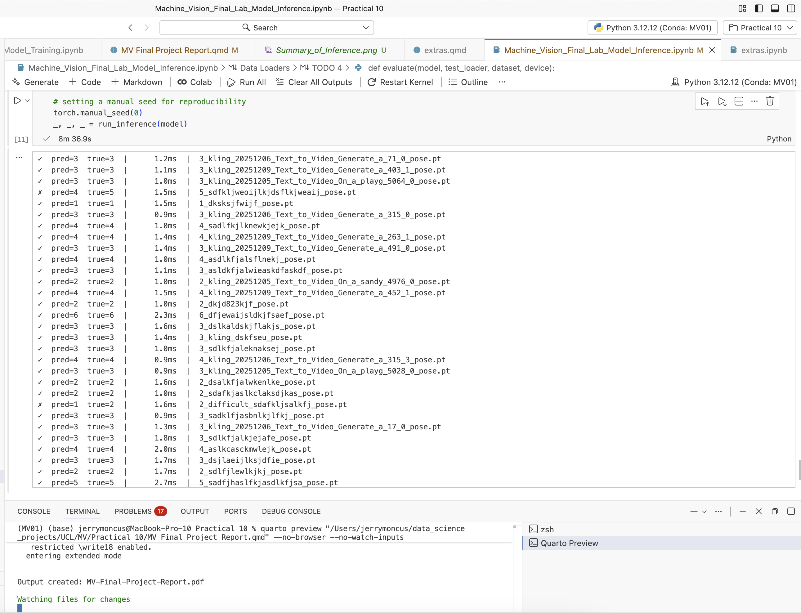{fig-align="center" width=100%}

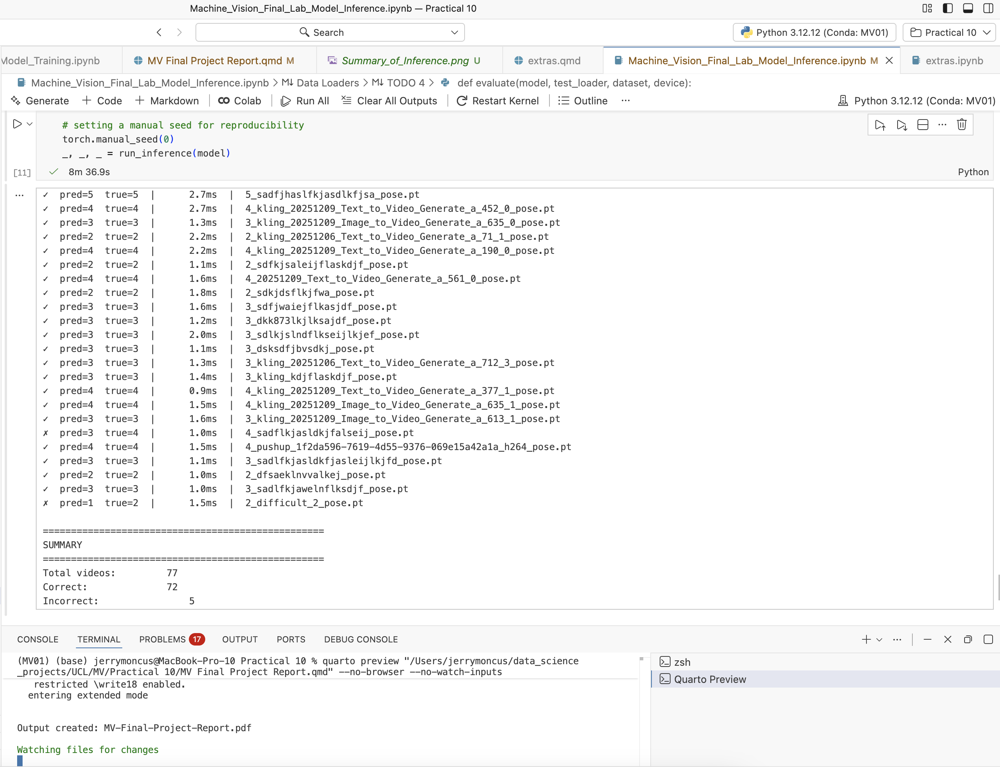{fig-align="center" width=100%}

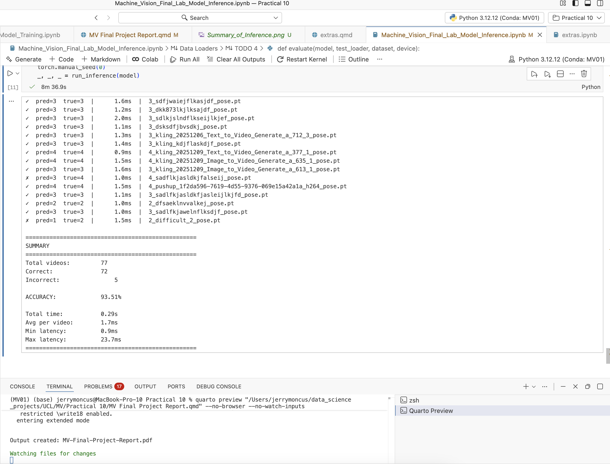{fig-align="center" width=100%}


# Trying Again

For safety's sake, I am going to use on my local machine the exact versions that colab defaults to, so there wont be any conflict that would require the TA to restart the session

Colab seems to default to the following library versions:

* Python: 3.12.12
* opencv-python: 4.12.0.88
* numpy: 2.0.2
* torch: 2.9.0
* torchvision: 0.24.0
* seaborn: 0.13.2
* pandas 2.2.2
* matplotlib 3.10.0
* huggingface_hub: 0.36.0
* tqdm: 4.67.1
* boto3: 1.42.24

I'm going to force install all these into my notebook, work locally, and hope results are the same.


Notes

* Trying to estimate poses in "video" mode introduced a complication with the frame timestamps not being monotonically increasing. in the end, I chose to detect in "image" mode
* I chose "lite" instead of "heavy" model for speed - heavy took 15 seconds per video, lite takes 4-5 (both on local GPU). I'll try heavy later if accuracy on lite is too bad
* first run after migrating versions: 81.61% final accuracy (not bad, not great), likely chalked up to "lite" pose estimator